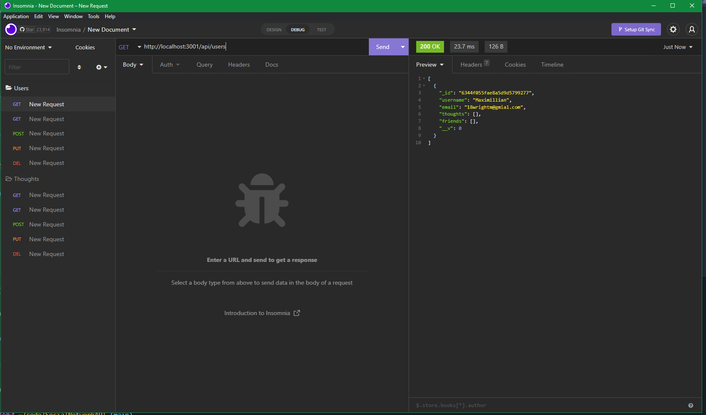

  # Social network Api

1. [Description](#Description)
2. [Install Instructions](#Install-Instructions)
3. [How to use this app](#How-to-use-this-app)
4. [License](#License)
5. [Credits](#Credits)
6. [Tests](#Tests)
7. [Github](#Github)
8. [Contact Me](#Contact-Me)

  
          
  
  
  ## Description 
  The app is solely backend and was created with mongoose and express. It is the basics of a social media app and can have users and what their thoughts are. Using insomnia you can use the CRUD routes and use the app.
  
  ## Install Instructions
  No installation is necessary.
  
  ## How to use this app
  Once the server is started with npm install and npm start you can go to insomnia. In insomnia you are able to use the routes I've created to create users and thoughts and see the created thoughts and users. You can also update and delete the thoughts and users as well.
  
  ## Credits
  This application was made by Maximillian

  ## Tests
  No testing.

  ## Github 
 Here is the link to my github account [Wolfgang978](https://github.com/Wolfgang978)
  
  
  ## Contact Me
  If you have any further questions about the application you can reach me at 18wrightm@gmail.com

  ## Screenshot
  

  ## Video Link
  [Link to demonstration video](https://drive.google.com/file/d/1Q4J9hFKN7YtKdA2ZJwd-azAI3_bJ2TfT/view)
 
